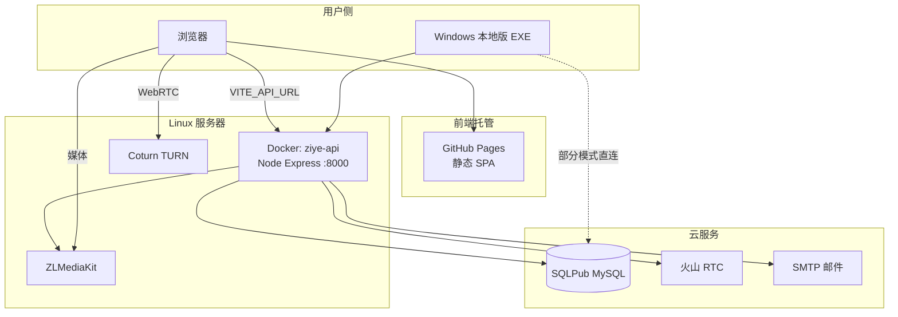

# 紫夜公会官网 — 完整架构说明（入门版）

> 本文面向想了解「这个网站是怎么搭起来的」的同学。  
> 尽量少用黑话；必要时会先解释再往下说。  
> 仓库：https://github.com/PurpleNightG/PurpleNightG.github.io

---

## 1. 一句话理解整站

紫夜官网可以拆成三块：

1. **前端（网页界面）** — 用户在浏览器里看到的页面，托管在 **GitHub Pages**  
2. **后端（API 服务）** — 处理登录、成员、催促、课程等业务，跑在 **Linux + Docker** 上  
3. **数据库（MySQL）** — 长期保存数据，使用云上的 **SQLPub**

另外还有可选能力：

- **屏幕共享 / 会议** — 用 WebRTC + 自建 TURN / 流媒体（ZLMediaKit）+ 云端 RTC（火山）
- **Windows 本地版** — 把前端和后端打成 EXE，方便成员本机使用（仍要连数据库或远程 API）

```text
用户浏览器
    │
    │  打开网页（GitHub Pages）
    ▼
前端 SPA（React）
    │
    │  HTTPS 请求 JSON API
    ▼
后端 Express（Docker 容器 ziye-api）
    │
    ├──► MySQL（SQLPub）     存成员、请假、课程、催促配置…
    ├──► ZLMediaKit / Coturn 屏幕共享辅助
    └──► 火山 RTC / 邮件等    会议、管理员验证码登录等
```

---

## 2. 给小白的几个概念

| 名词 | 可以怎么理解 |
|------|----------------|
| **前端** | 页面长什么样、按钮点了跳哪；主要是 HTML/CSS/JS（这里用 React） |
| **后端 / API** | 服务器上的程序；前端问它「这个人能不能登录」「催促名单有谁」 |
| **数据库** | 放「真正要记住的东西」的仓库；重启网页也不会丢 |
| **部署** | 把代码放到能被别人访问的地方（Pages / Docker） |
| **JWT** | 登录成功后服务器发的「通行证」；之后请求要带上它 |
| **Docker** | 一个隔离的运行环境，里面装好 Node，用来跑后端 |
| **SPA** | 单页应用：大部分页面切换不整页刷新，由前端路由控制 |

---

## 3. 技术栈总览

### 3.1 前端（仓库根目录）

| 类别 | 技术 | 大致版本 |
|------|------|----------|
| 语言 | TypeScript | ^5.2 |
| UI 框架 | React | ^18.2 |
| 构建工具 | Vite | ^5.0 |
| 样式 | Tailwind CSS | ^3.3 |
| 路由 | React Router（HashRouter） | ^6.21 |
| 富文本 | TipTap | ^3.23 |
| 表格公式 | HyperFormula | ^3.3 |
| 实时音视频 | PeerJS、火山 RTC、Agora SDK（兼容） | 见 package.json |
| 图标 | lucide-react | ^0.294 |
| Markdown | react-markdown 等 | ^9 |

为什么用 **HashRouter**（地址里有 `#`）？  
GitHub Pages 对「直接打开深层路径」支持不好；用 `#/admin/...` 这种形式更稳。

### 3.2 后端（`server/`）

| 类别 | 技术 | 大致版本 |
|------|------|----------|
| 运行时 | Node.js 20（Docker 镜像 `node:20-bookworm`） | — |
| Web 框架 | Express | ^4.18 |
| 数据库驱动 | mysql2 | ^3.6 |
| 登录凭证 | jsonwebtoken + bcryptjs | ^9 / ^2.4 |
| 上传 | multer | ^2 |
| 邮件 | nodemailer | ^9 |
| 配置 | dotenv | ^16 |

### 3.3 基础设施

| 组件 | 用途 |
|------|------|
| GitHub Pages | 托管前端静态文件 |
| GitHub Actions | 推送到 `main` 后自动 `npm run build` 并发布 |
| Docker（`ziye-api`） | 在 CentOS 等 Linux 上跑后端 |
| SQLPub（MySQL） | 云数据库 |
| Nginx / NAT（按环境） | 域名反代、端口映射 |
| ZLMediaKit + Coturn | 流媒体 / TURN（屏幕共享辅助） |
| 火山引擎 RTC | 会议 / 共享场景的云端能力 |

---

## 4. 整体架构图（再细一点）



**生产环境常见地址（可能随运维调整）：**

| 角色 | 示例 |
|------|------|
| 官网前端 | GitHub Pages / 绑定域名 |
| API | `https://api.sh01.eu.org/api` |
| 后端容器内端口 | `8000`（宿主机 host 网络） |
| 外网映射示例 | `18000 → 8000` |
| TURN | 公网 IP + 端口 `10115` |
| ZLM HTTP | 常经 API 反代 `/api/ziye`，避免浏览器直接打 HTTP |

---

## 5. 前端架构

### 5.1 目录怎么读

```text
src/
  App.tsx              # 总路由入口
  pages/               # 按角色拆开的页面
    admin/             # 管理端
    student/           # 学员端
    assistant/         # 助教端（用学员登录态）
    Home.tsx / Docs…   # 公开页
  components/          # 可复用组件（表格、弹窗、悬浮窗等）
  contexts/            # 跨页面状态（如角标 Badge）
  hooks/               # 自定义钩子
  utils/api.ts         # 所有 API 封装
  index.css            # 全局样式 / 主题
public/
  docs/                # Markdown 教学文档静态资源
```

### 5.2 四种「用户视角」

| 视角 | 路由前缀 | 谁在用 | 怎么进 |
|------|----------|--------|--------|
| 公开站 | `/`、`/docs`、`/downloads`、`/screen-share` | 游客 | 不用登录 |
| 管理端 | `/admin/*` | 管理员 | 管理账号登录 |
| 学员端 | `/student/*` | 正式学员 | 学员账号登录 |
| 助教端 | `/assistant/*` | 紫夜助教 | **仍用学员 Token**，后端再校验助教身份 |

登录页：`/login`。  
前端用 `ProtectedRoute` 区分 admin token / student token。

### 5.3 前端主要业务模块（管理端举例）

- 成员管理、请假、黑点、退队 / 留队  
- **催促名单**（训练催促 + 考勤进度；规则可在「规则总设置」配置）  
- 课程与进度、考核与监控  
- 表格文档（类简易协作表）  
- 问卷 / 意见箱  
- 文档管理、安全中心、反作弊相关配置  
- 屏幕共享 / 会议相关入口与悬浮窗  

助教端是管理端能力的「缩小版」：看自己的学员、催促、进度、审批申请等。

### 5.4 前端如何找后端

构建时注入环境变量（Vite 的 `VITE_*`）：

| 变量 | 作用 |
|------|------|
| `VITE_API_URL` | API 根地址，如 `https://api.sh01.eu.org/api` |
| `VITE_ZIYE_SERVER_URL` | 流媒体经 API 的代理地址 |
| `VITE_ZIYE_TURN_HOST` / `PORT` / `USE_TURN` | TURN 配置 |

GitHub Actions 在 `.github/workflows/deploy.yml` 里写死了生产环境这些变量，推 `main` 就会重新打包前端。

---

## 6. 后端架构

### 6.1 目录怎么读

```text
server/
  index.js             # 创建 Express、挂载路由、启动端口
  routes/              # 按业务拆分的接口文件
  utils/               # 公共逻辑（鉴权、催促规则、考勤计算…）
  config/database.js   # MySQL 连接池
  migrations/          # SQL 迁移脚本（部分也会在启动时自动补表）
  init.sql             # 初始化参考
  .env                 # 仅服务器上有，含数据库密码（勿提交公开仓库）
```

### 6.2 鉴权怎么走

```text
登录成功
  → 服务器签发 JWT（里面有用户类型、id 等）
  → 浏览器存起来（localStorage 等）
  → 之后每个 API 请求 Header：Authorization: Bearer <token>
  → 中间件校验：签名是否正确、会话是否被踢、账号是否还在
```

- 管理员密码：bcrypt 哈希存储  
- 远程登录：可发邮箱 OTP  
- 会话可落库（`login_sessions`），支持踢下线  

### 6.3 主要 API 前缀（按模块）

| 前缀 | 模块 |
|------|------|
| `/api/auth`、`/api/student` | 登录 / 校验 |
| `/api/members` | 成员 |
| `/api/leaves`、`/api/blackpoints` | 请假、黑点 |
| `/api/reminders` | 训练催促、考勤规则 |
| `/api/courses`、`/api/progress` | 课程与进度 |
| `/api/quit`、`/api/retention` | 退队、留队 |
| `/api/assessments*` | 考核 |
| `/api/sheets` | 表格文档 |
| `/api/surveys`、`/api/opinion-box` | 问卷、意见箱 |
| `/api/room`、`/api/meeting`、`/api/volc`、`/api/turn`、`/api/ziye` | 共享 / 会议 / TURN / 流媒体代理 |
| `/api/assistant` | 助教工作流 |
| `/api/anticheat` | 考试反作弊相关 |
| `/api/badges`、`/api/settings`、`/api/docs` | 角标、系统设置、文档 |
| `/api/health` | 健康检查 |

更细的实现看 `server/index.js` 里 `app.use(...)` 挂载列表。

### 6.4 业务亮点：催促 / 考勤规则

- 配置存在数据库 `system_settings` 键 **`reminder_rules_config`**（JSON）  
- 代码入口：`server/utils/reminderRulesConfig.js`  
- 训练催促名单、踢人周期、考勤进度条都会读这份配置  
- 管理端「规则总设置」可改天数、阶段、名单标签文案与颜色  
- **踢人周期**模式下：不显示「自定义延期本轮踢不着」的人，也不显示「请假缓冲」中的人  

### 6.5 什么进数据库，什么只在内存

| 类型 | 例子 | 重启后端后 |
|------|------|------------|
| 持久化（MySQL） | 成员、请假、课程进度、催促配置、问卷、表格修订 | 还在 |
| 进程内存 | 正在进行的屏幕共享房间成员、部分实时聊天、表格「谁在编辑」在场状态 | **会丢**，需重新进房 |

设计原则：  
「要长期记住的」→ 数据库；「这一场直播 / 这一次在线协作的临时状态」→ 内存即可。

---

## 7. 数据库（MySQL / SQLPub）

- 库名示例：`png_management`  
- 连接信息在服务器 `server/.env` 的 `DB_*`  
- 连接池较小（避免云库连接数打满）  

**常见表族（不完全列表）：**

| 表 / 表族 | 内容 |
|-----------|------|
| `admins` / `members` | 管理员、学员成员 |
| `leave_records` 等 | 请假与缓冲期 |
| `reminder_list`、考勤相关表 | 催促自定义期限、忽略、正式队员 180 天策略等 |
| `courses` / `student_course_progress` | 课程与进度 |
| `system_settings` | 全局键值配置（含规则 JSON） |
| `workbooks` / revisions | 表格文档 |
| `surveys` 相关 | 问卷 |
| `exam_*` / `dll_whitelist` | 考核与反作弊 |
| `login_sessions` / 审计日志 | 登录与安全 |
| 助教相关 pending / assignment | 助教认领、审批 |

服务启动时往往会自动执行一批「缺表就建」的迁移，方便新环境拉起。

---

## 8. 部署架构（你们实际怎么上线）

### 8.1 前端：GitHub Pages（自动）

1. 开发者本地改代码 → `git push` 到 `main`  
2. GitHub Actions 跑 `npm ci` + `npm run build`  
3. 把 `dist/` 发布到 GitHub Pages  
4. 用户刷新浏览器即用到新前端  

**注意：** 只推前端不够；若改了 `server/`，还要单独更新 Linux 上的 API。

### 8.2 后端：Linux + Docker（手动 / 运维）

目录约定：`/opt/ziye-api`（里面是仓库的 `server/` 内容 + `.env`）  
容器名：`ziye-api`

**停止：**

```bash
sudo docker stop ziye-api
```

**启动（容器还在）：**

```bash
sudo docker start ziye-api
```

**重建运行（容器已删或首次）：**

```bash
sudo docker run -d \
  --name ziye-api \
  --restart unless-stopped \
  --network host \
  -v /opt/ziye-api:/app \
  -w /app \
  node:20-bookworm \
  bash -c "npm install --omit=dev && node --use-system-ca index.js"
```

**更新代码后：**

1. 把新的 `server/` 同步到 `/opt/ziye-api`（保留 `.env`）  
2. `sudo docker restart ziye-api`  
3. 若改了 `package.json` 依赖，需进容器或重建时重新 `npm install`  

**验收：**

```bash
curl -sS http://127.0.0.1:8000/api/health
```

### 8.3 流媒体 / TURN（`deploy/ziye-stream/`）

与主 API 分开的一套 Docker Compose，通常放在 `/opt/ziye-stream`，提供：

- ZLMediaKit（推拉流）  
- Coturn（NAT 穿透用 TURN）  

官网前端通过环境变量和 `/api/ziye` 代理对接，避免 HTTPS 页面去请求明文 HTTP。

### 8.4 Windows 本地版（`local-app/`）

- 把前端构建产物 + Node 后端打成可分发 EXE / 便携包  
- 适合公会内部使用；数据库凭据不能出现在公开仓库  
- 与「GitHub Pages + 远程 API」是另一条使用路径，不是互相替代的全部能力  

---

## 9. 一次完整请求长什么样（举例）

**场景：管理员打开「催促名单」**

```text
1. 浏览器已登录，本地有 admin JWT
2. 打开 #/admin/... 催促页
3. 前端调用 GET https://api.sh01.eu.org/api/reminders?mode=kick_cycle
4. Express 校验 JWT → 读 system_settings 与成员表
5. trainingReminderList / attendanceReminder 按规则算出名单
6. 返回 JSON
7. React 渲染表格（标签颜色、进度条等）
```

**场景：学员打开首页浮窗**

```text
学员 JWT → /api/... 查询自己的训练催促 / 考勤剩余
→ 前端 StudentHome 决定弹不弹、弹什么文案
```

---

## 10. 本地开发怎么跑（给想改代码的人）

### 前端

```bash
# 仓库根目录
npm install
npm run dev
```

默认连 `.env.development` 里配置的 API。

### 后端

```bash
cd server
npm install
# 配置好 .env（数据库等）
npm run dev    # nodemon 热重载
```

默认常见端口：`3000`（本地） / 生产 Docker：`8000`。

### 构建前端

```bash
npm run build   # 产出 dist/，与 CI 一致
```

---

## 11. 安全与协作注意

1. **永远不要**把含真实密码的 `.env`、数据库账号提交到公开 GitHub  
2. SQLPub 要给服务器出口 IP 做白名单  
3. 生产 `JWT_SECRET` 要用足够长的随机串  
4. 管理端高危操作有审计 / 二次验证（视功能而定）  
5. 反作弊、考试截图等属于敏感能力，权限应收紧  
6. 学架构时建议顺序：先会画「浏览器 → API → 数据库」→ 再点开一个具体模块（如催促）跟一条请求  

---

## 12. 推荐阅读路径（由浅入深）

1. 本文第 1～4 节：先建立全局图  
2. `src/App.tsx`：看路由如何分角色  
3. `src/utils/api.ts`：看前端调用了哪些接口  
4. `server/index.js` + 某一个 `server/routes/*.js`：看请求如何落地  
5. `server/config/database.js`：看如何连库  
6. `.github/workflows/deploy.yml` + 本文第 8 节：看如何上线  
7. 专题：`server/utils/reminderRulesConfig.js`（规则配置）、`deploy/ziye-stream/部署指南.md`（流媒体）

---

## 13. 仓库里相关文档

| 文档 | 内容 |
|------|------|
| 本文 `docs/网站架构文档.md` | 全站架构入门 |
| `README.md` | 前端项目简介 |
| `server/README.md` | 后端快速开始 |
| `local-app/README.md` / `local-app copy/README.md` | 本地版与 Docker API 部署说明 |
| `deploy/ziye-stream/部署指南.md` | ZLM + Coturn 部署 |
| `server/DATABASE_SCHEMA.md` | 数据库结构补充（若有） |

---

## 14. 版本与维护说明

- 架构会随功能迭代变化（例如催促规则从硬编码改为可配置 JSON）  
- 以仓库当前 `main` 分支代码为准；若本文与代码冲突，**以代码为准**并欢迎更新本文  
- 文档编写目的：方便新人理解系统边界，不是替代逐文件注释  

---

**维护者提示：**  
前端改完推 GitHub 即可自动上线；后端改完必须同步 `/opt/ziye-api` 并 `docker restart ziye-api`（或按第 8.2 节重建容器）。两者缺一不可。
